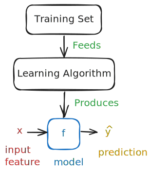

# Model

- A model learns from [training](../concept/training.md) data if its performance improves after data is taken into account.
- A model is said to overfit if it performs well on training data but poorly on unseen data.
- On the other hand, a model is said to underfit if it performs poorly on both training and unseen data.

## Process

A training feeds a learning algorithm. The learning algorithm then produces a function that maps the input to the output. The function is the model. The model takes an input feature and outputs a prediction.